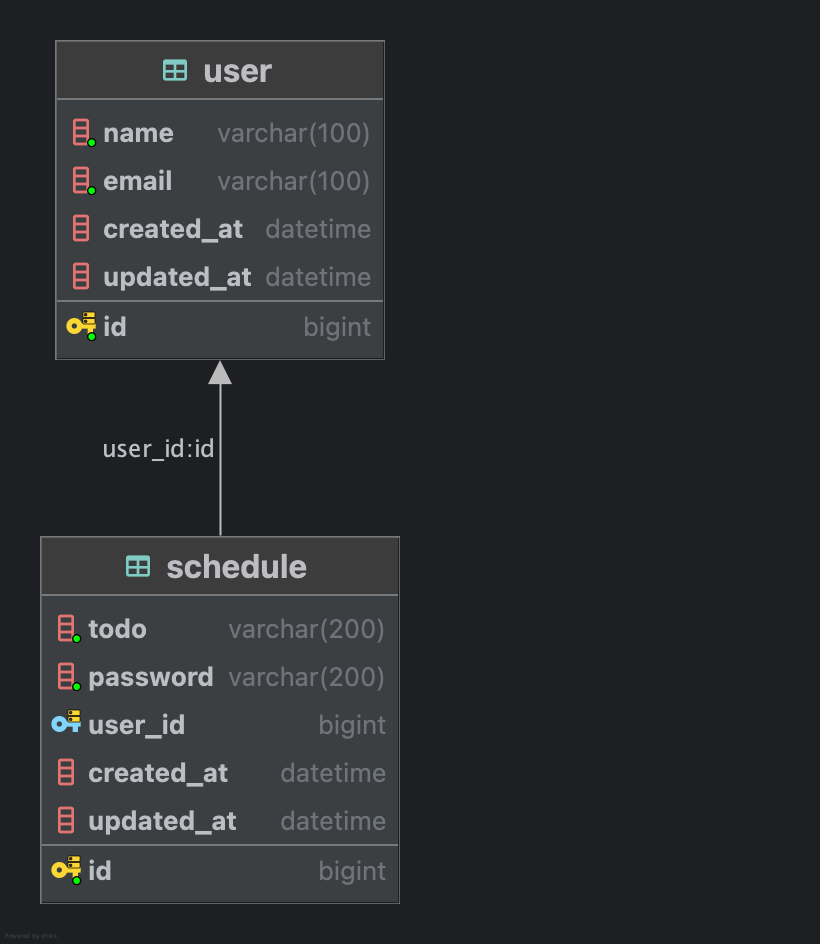

# Schedule API  
<div style="display: flex; gap: 5px;">


</div>

##  개요
- [📌 프로젝트 회고(velog)](https://velog.io/@wannabeing/SPRING-%EC%9D%BC%EC%A0%95-API-%EA%B3%BC%EC%A0%9C-%ED%9A%8C%EA%B3%A0)
- 개발기간: 2025.03.19(수) ~ 2025.03.26(수)
- 자바버전: OpenJDK 17
- 사용기술: Spring Boot, JDBC Template, MySQL
- RESTful한 일정 관리 백엔드 API 서버

---

## 기능 목록
### 👤 유저 기능
- **R**: 유저 목록 조회

### 🗓️ 일정 기능 (CRUD)
- **C**: 일정 등록 (비밀번호 입력 필요)
- **R**: 일정 단건 조회
- **R**: 일정 전체 조회 (페이징 기능 구현)
- **U**: 일정 수정 (비밀번호 검증 필요)
- **D**: 일정 삭제 (비밀번호 검증 필요)

### 🚀 추가 기능
- 예외처리 핸들러 (@RestControllerAdvice)
- 비밀번호 인코딩 (BCrypt)
- 유효성 검증 (@Validated)
- `@ModelAttribute`를 통한 공통 유저 ID 유효성 검증
---

## API 명세서
### 🎃 [[Postman] Schedule API 문서 보기](https://documenter.getpostman.com/view/40705962/2sAYkKJdFN)


> ### 예시) Schedule 단건 조회
>#### Request (GET)
>- URL
>  - {BASE_URL}/{userId}/schedule/{scheduleId}
>  - ex. http://localhost:8080/1/schedule/22
>- 파라미터
>  - **[필수]** (Long) userId: 유저 id
>  - **[필수]** (Long) scheduleId: 일정 id  
>#### Response (JSON)
>```json
>{
>    "id": 22, // scheduleId
>    "todo": "오늘의 할일!!",
>    "userId": 1, // userId
>    "createdAt": "2025-03-26 00:55:47",
>    "updatedAt": "2025-03-26 00:55:47"
>}
>```


---

## ERD
### 유저(User)와 일정(Schedule)은 1:N 관계입니다.
- 유저 1명은 여러 일정을 가질 수 있습니다.
- 각 일정은 반드시 유저에 속해야 합니다.



---

## 프로그램 구조
```
src
└── main
    └── java
        └── org.example.spartaschedule
            ├── config                            # 🔐 환경 설정
            │   └── SecurityConfig.java           # 스프링 시큐리티 설정
            │
            ├── controller                        # 📢 Presentation Layer
            │   ├── ScheduleController.java       # 일정 관련 API
            │   └── UserController.java           # 유저 조회 API
            │
            ├── dto                               # 📦 요청, 응답 DTO 
            │   ├── ScheduleRequestDto.java       # 일정 요청 DTO
            │   ├── ScheduleResponseDto.java      # 일정 응답 DTO
            │   ├── PageScheduleResponseDto.java  # 페이징된 일정 응답 DTO
            │   ├── UserResponseDto.java          # 유저 응답 DTO
            │   └── ApiResponseDto.java           # API 응답 DTO (성공/실패 등)
            │
            ├── entity                            # 📦 DB와 매핑되는 엔티티
            │   ├── Schedule.java                 # 일정 엔티티
            │   └── User.java                     # 유저 엔티티
            │
            ├── exception                         # 🚨 전역 예외 핸들링
            │   └── ApiExceptionHandler.java      # API 예외 핸들링
            │
            ├── repository                               # 🥡 Repository Layer
            │   ├── ScheduleRepository.java              # 일정 레포지토리 인터페이스
            │   ├── UserRepository.java                  # 유저 레포지토리 인터페이스
            │   ├── JdbcTemplateScheduleRepository.java  # 일정 JDBC 템플릿 구현체
            │   └── JdbcTemplateUserRepository.java      # 유저 JDBC 템플릿 구현체
            │
            ├── service                         # 🧩 Business Layer
            │   ├── ScheduleService.java        # 일정 서비스 인터페이스
            │   ├── ScheduleServiceImpl.java    # 일정 서비스 구현체
            │   ├── UserService.java            # 유저 서비스 인터페이스
            │   └── UserServiceImpl.java        # 유저 서비스 구현체
            │
            └── SpartaScheduleApplication.java  # ✅ Main()

```